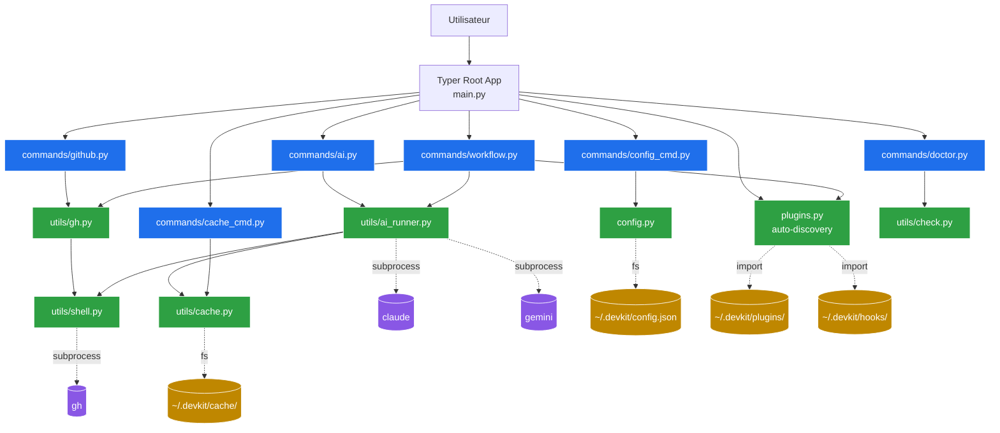
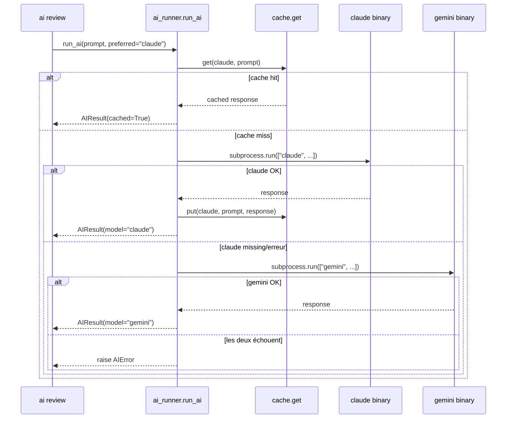
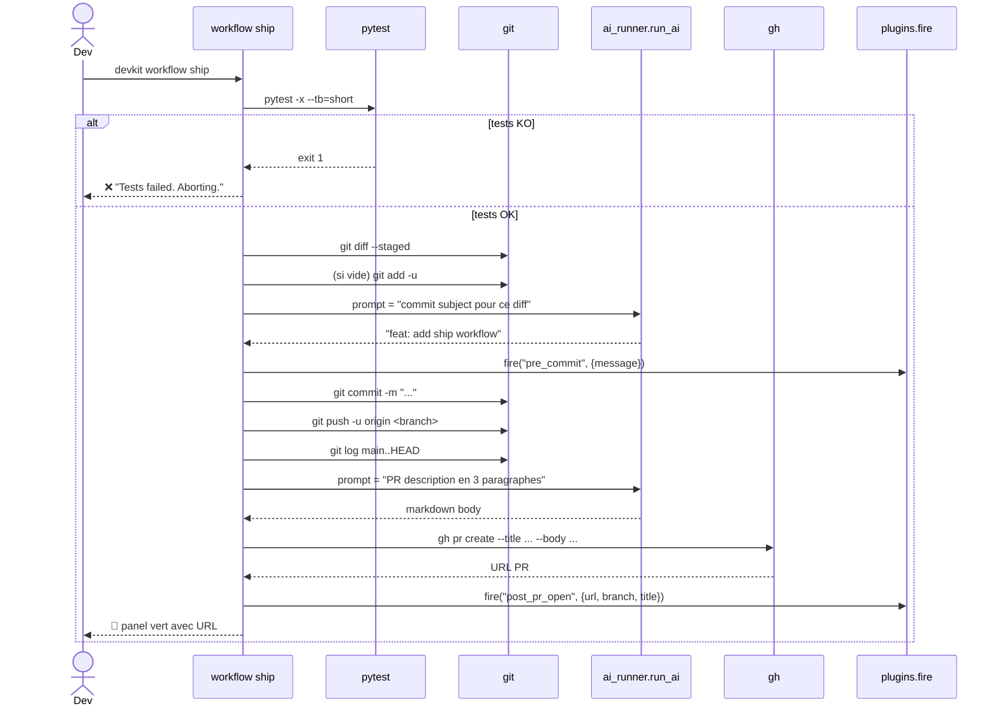

# devkit — Architecture & Design

> Document d'analyse de l'architecture, des choix techniques et des tests
> du projet **devkit** (cf. `Modern_CLI_Project.pdf`).

---

## 1. Vue d'ensemble

`devkit` est un **méta-outil CLI** écrit en Python qui orchestre des CLIs
modernes (`gh`, `gh copilot`, `gemini`, `claude`, `git`, `fzf`) via
`subprocess`, et expose un workflow développeur unifié.

Il ne réimplémente **rien** de ce que ces outils savent déjà faire — il les
compose. C'est cette philosophie de *composition* qui justifie chaque choix
architectural ci-dessous.

### 1.1 Hiérarchie des commandes

```
devkit
├── doctor                       # diagnostic toolchain
├── gh                           # GitHub CLI
│   ├── issues                   # liste rich des issues
│   ├── pr-summary               # vue détaillée d'une PR
│   ├── start-feature            # crée une branche feature
│   ├── open-pr                  # crée une PR (interactif)
│   ├── run-status               # workflows CI récents
│   ├── repo-init                # gh repo create + clone
│   ├── search   [bonus]         # search issues/prs/repos/code
│   └── stats    [bonus]         # PRs merged + top contributors
├── ai                           # AI CLI tools
│   ├── explain                  # gh copilot explain
│   ├── suggest                  # gh copilot suggest
│   ├── review                   # AI review d'une PR
│   ├── commit                   # message de commit conventionnel
│   ├── summarize                # PR en français pour non-tech
│   ├── docstring                # ajoute des docstrings Google-style
│   ├── changelog [bonus]        # génère un Keep a Changelog
│   ├── test-gen  [bonus]        # génère un module pytest
│   └── ask       [bonus]        # Q&A one-shot (cache + fallback)
├── workflow                     # Orchestration multi-outils
│   ├── feature-start            # branche + PR draft + plan IA
│   ├── daily-digest             # PRs à reviewer + issues + CI
│   └── ship      [bonus]        # tests -> commit IA -> push -> PR IA
├── config                       # ~/.devkit/config.json
│   └── show / set / reset / path
├── cache         [bonus]        # cache disque des réponses IA
│   └── info / clear
└── plugin <name> [bonus]        # plugins utilisateur (auto-mount)
```

---

## 2. Architecture en couches



### 2.1 Découpage en 4 couches

| Couche | Module(s) | Rôle |
|---|---|---|
| **CLI** | `main.py` | Point d'entrée Typer ; assemble les sub-apps. |
| **Commands** | `commands/*.py` | Logique métier de chaque commande. Pas d'I/O direct vers `subprocess`. |
| **Utils** | `utils/*.py` | Wrappers autour des CLIs externes, cache, helpers Rich. |
| **Persistence** | `config.py`, `utils/cache.py` | I/O disque (JSON), aucune logique métier. |

**Règle de dépendance :** une couche ne dépend **que** des couches inférieures.
Aucun module `utils/` n'importe `commands/`. Cela garantit qu'on peut tester
les utils sans Typer.

---

## 3. Choix techniques justifiés

### 3.1 Pourquoi Typer (et pas argparse/Click) ?

| Critère | argparse | Click | **Typer** |
|---|---|---|---|
| Verbose | ✗ (très) | ~ | ✓ |
| Type hints natifs | ✗ | ✗ | ✓ |
| Sub-apps composables | ~ (lourd) | ✓ | ✓ |
| Intégration Rich | ✗ | ~ | ✓ (built-in) |
| `--help` auto-généré | ~ | ✓ | ✓ (Rich) |

Typer = `Click` + `pydantic`-style annotations. Une commande s'écrit comme une
simple fonction Python typée :

```python
@app.command()
def issues(repo: str = typer.Option(""), limit: int = typer.Option(15)):
    ...
```

**Conséquence architecturale :** chaque sous-commande est une fonction
isolée, importable et testable indépendamment.

### 3.2 Pourquoi `subprocess` plutôt que les SDK Python (PyGithub, anthropic, …) ?

C'est **le** choix structurant du projet. Il est volontaire, et cohérent avec
le brief PDF (« composability »).

**Avantages :**
1. **Réutilise la config existante** — `gh` est déjà authentifié sur la
   machine ; pas besoin de gérer des tokens.
2. **Aucune dépendance lourde** — `pip install devkit` ne tire que `typer` et
   `rich`. Pas de `PyGithub`, pas de `anthropic`, pas de `google-generativeai`.
3. **Suit l'écosystème** — quand `gh` ajoute une commande, devkit en bénéficie
   sans release.
4. **Pédagogie** — l'objectif du projet est précisément d'apprendre à *composer*
   des CLIs.

**Coûts assumés :**
1. Plus lent (~100ms par appel à cause du fork+exec).
2. Pas de typage statique des réponses → on parse du JSON manuellement.
3. Erreurs réseau → on dépend du code retour de `gh`.

**Mitigation** : le wrapper `utils/shell.py` normalise tous ces appels :

```python
def run_cmd(args: list[str], *, input_text=None, check=True) -> str:
    try:
        result = subprocess.run(args, input=input_text,
                                capture_output=True, text=True, check=check)
    except FileNotFoundError as exc:
        raise RuntimeError(f"Command not found: {args[0]}") from exc
    except subprocess.CalledProcessError as exc:
        details = (exc.stderr or exc.stdout or "").strip() or "command failed"
        raise RuntimeError(f"{' '.join(args)} -> {details}") from exc
    return result.stdout.strip()
```

### 3.3 Pourquoi Rich ?

Le PDF demande explicitement « rich-formatted tables » et « panels, spinners
where needed ». Rich coche tout :

* `Table` avec couleurs par colonne — affichage des issues, PRs, runs CI.
* `Panel` — encadrement coloré pour les blocs IA (review, summary, etc.).
* `Progress` + `SpinnerColumn` — feedback pendant les appels IA (qui prennent
  5–30s).
* `Syntax` — highlighting Python pour la prévisu de `ai docstring`.
* `Confirm` / `Prompt` — interactions safe.

### 3.4 Pourquoi un cache disque pour l'IA ?

Un appel à `claude` ou `gemini` coûte du temps (5–30s) et de l'argent.
**80% des prompts sont répétés en dev** (relancer `devkit ai review 42` après
un fix CSS doit être instantané si le diff n'a pas changé).

**Implémentation** (`utils/cache.py`) :

```
clé = sha256(model || "\0" || prompt)
fichier = ~/.devkit/cache/<clé>.json
{ "ts": <unix>, "model": ..., "response": ... }
TTL par défaut : 24h
```

**Décision : cache opportuniste, jamais bloquant.** Toute erreur d'I/O
(disk full, permission denied) est silencieusement ignorée :

```python
def put(model, prompt, response):
    try:
        ...
    except OSError:
        pass  # cache failure must never break a real command
```

### 3.5 Pourquoi un système de fallback multi-IA ?

L'utilisateur peut ne pas avoir les deux backends. Si `claude` échoue ou
n'est pas installé, devkit retombe sur `gemini` automatiquement.



### 3.6 Pourquoi un système de plugins/hooks ?

**Hypothèse forte : chaque équipe a ses propres conventions** (préfixes de
commit, lint avant push, notification Slack après PR).

Plutôt que de tout mettre dans devkit, on offre deux extensions :

1. **Hooks** (`~/.devkit/hooks/*.py`) — fonctions appelées à des moments
   précis (`pre_commit`, `post_pr_open`, `pre_review`,
   `post_feature_start`).

2. **Plugin commands** (`~/.devkit/plugins/*.py`) — chaque fichier qui
   définit `app = typer.Typer(...)` est mounté sous `devkit plugin <nom>`.

Découverte par `importlib.util.spec_from_file_location` (pas d'entry points
setuptools — l'utilisateur peut prototyper sans `pip install`).

Exemple de hook :

```python
# ~/.devkit/hooks/slack_notify.py
def post_pr_open(ctx):
    import requests
    requests.post(SLACK_HOOK, json={"text": f"PR opened: {ctx['url']}"})
```

### 3.7 Pourquoi `~/.devkit/config.json` plutôt que YAML/TOML ?

* **Zéro dépendance** : `json` est dans la stdlib.
* **Édition humaine raisonnable** pour 5 clés.
* **Schéma stable** : 4 clés depuis le début (`ai_tool`, `default_repo`,
  `theme`, `show_spinner`). YAML serait surdimensionné.

`load_config()` merge **toujours** les valeurs sauvegardées par-dessus les
DEFAULTS, donc l'ajout d'une nouvelle clé ne casse jamais une config existante.

### 3.8 Pourquoi `src/` layout ?

```
devkit_project/
└── src/
    └── devkit/
        ├── main.py
        ├── commands/
        └── utils/
```

* Force `pip install -e .` avant d'importer `devkit` → on teste le **package
  installé**, pas le checkout. Aucun import accidentel via `sys.path`.
* Compatible avec PEP 621 (`pyproject.toml` moderne).
* C'est la convention recommandée par PyPA depuis 2021.

---

## 4. Flux d'une commande typique : `devkit workflow ship`

C'est la commande "send-it" : tests → commit IA → push → PR avec description IA.



**Composability en action :** une seule commande utilisateur orchestre
`pytest`, `git`, `claude`/`gemini`, `gh`, et les hooks utilisateur.

---

## 5. Stratégie de tests

### 5.1 Pyramide de tests

```
        ┌──────────────┐
        │  Smoke (CLI) │   6 tests — test_cli.py
        ├──────────────┤
        │   Plugins    │   6 tests — test_plugins.py
        │  AI Runner   │   6 tests — test_ai_runner.py (mocks)
        │    Cache     │   9 tests — test_cache.py
        ├──────────────┤
        │ Utils & cfg  │  22 tests — shell, check, config*, ai_helpers
        └──────────────┘
        Total : 49 tests, 43% coverage globale
```

### 5.2 Choix : tests unitaires plutôt qu'e2e

**Pourquoi :** un test e2e devrait spawner un vrai `gh` et un vrai `claude`,
qui demandent des credentials, un réseau, et facturent l'appel IA. C'est OK
pour un CI nightly, jamais pour `pytest` en local.

**Conséquence :** chaque test mocke la frontière `subprocess`. Exemple :

```python
def test_run_ai_falls_back_when_preferred_fails(monkeypatch):
    def fake_call_one(model, prompt, *, non_interactive):
        if model == "claude":
            raise ai_runner.AIError("claude is broken")
        return f"from-{model}"
    monkeypatch.setattr(ai_runner, "_call_one", fake_call_one)
    result = ai_runner.run_ai("hi", preferred="claude", use_cache=False)
    assert result.model == "gemini"
```

### 5.3 Couverture ciblée

| Module | Couverture | Justification |
|---|---|---|
| `utils/shell.py` | **100%** | Coeur des appels subprocess — tout doit passer |
| `config.py` | **100%** | I/O JSON simple, testable à 100% |
| `utils/check.py` | **100%** | Détection de binaires manquants |
| `plugins.py` | **95%** | Discovery de plugins/hooks |
| `utils/cache.py` | **92%** | Cache disque |
| `main.py` | **84%** | Composition Typer |
| `utils/ai_runner.py` | **71%** | Fallback chain testée via monkeypatch |
| `commands/*.py` | 12–43% | Couvert au niveau smoke par CliRunner |

Les `commands/*.py` ont une couverture faible **par design** : tester
réellement leur corps demanderait de mocker `gh`, `claude`, `git`,
`pytest`… On se contente d'un smoke test (`--help` répond `0`).

### 5.4 Résultat

```
============================= test session starts ==============================
platform linux -- Python 3.10.12, pytest-9.0.3
collected 49 items

tests/test_ai_helpers.py   .......                                       [ 14%]
tests/test_ai_runner.py    ......                                        [ 26%]
tests/test_cache.py        .........                                     [ 44%]
tests/test_check.py        ....                                          [ 53%]
tests/test_cli.py          ......                                        [ 65%]
tests/test_config.py       .                                             [ 67%]
tests/test_config_roundtrip.py ....                                      [ 75%]
tests/test_plugins.py      ......                                        [ 87%]
tests/test_shell.py        ......                                        [100%]

============================== 49 passed in 0.93s ==============================
```

### 5.5 Ce que les tests **ne** couvrent **pas** (assumé)

* L'authentification réelle de `gh` (dépend de la machine).
* Les sorties exactes de `claude` / `gemini` (non déterministes).
* La concordance JSON ↔ schéma GitHub (changeable côté GitHub).
* Le rendu Rich exact (cosmétique).

Pour ces cas, `devkit doctor` sert de **test fonctionnel manuel** : il
vérifie que les vrais outils sont installés et authentifiés.

---

## 6. Ce qui pourrait être amélioré (futur)

| # | Amélioration | Effort | Bénéfice |
|---|---|---|---|
| 1 | Streaming des réponses IA (`Live` Rich) | M | UX (voir la réponse arriver) |
| 2 | Async batch (`asyncio.create_subprocess_exec`) pour `daily-digest` | M | -50% latence |
| 3 | `gh api` direct au lieu de `gh issue list --json` | S | Plus de champs |
| 4 | TUI Textual pour `devkit dashboard` | L | Refresh live |
| 5 | Hooks Git auto-installés (`devkit init-hooks`) | S | Bloquer commit si tests KO |
| 6 | Génération MCP server à partir des commandes Typer | L | devkit utilisable depuis Claude Desktop |
| 7 | Télémétrie opt-in pour mesurer les commandes utilisées | S | Roadmap data-driven |

---

## 7. Conclusion

Trois principes ont guidé chaque décision :

1. **Composer, pas réimplémenter.** Tout passe par `subprocess`. Les
   2700 lignes de Python ici n'ajoutent qu'un *coordinateur* au-dessus
   de `gh`, `claude`, `gemini`, `git`, `fzf`.

2. **Couches strictes.** `commands → utils → subprocess`. Pas de boucle de
   dépendance. Conséquence directe : le test runner `pytest` tourne en
   < 1 seconde sur 49 tests.

3. **Échec gracieux.** Le cache, les hooks, l'IA secondaire — tous peuvent
   tomber sans casser la commande de l'utilisateur. `devkit ship` continue
   même si `gemini` est mort, parce que le fallback choisit `claude`, et
   inversement.

C'est exactement l'« instinct de composabilité » que le brief réclame.
